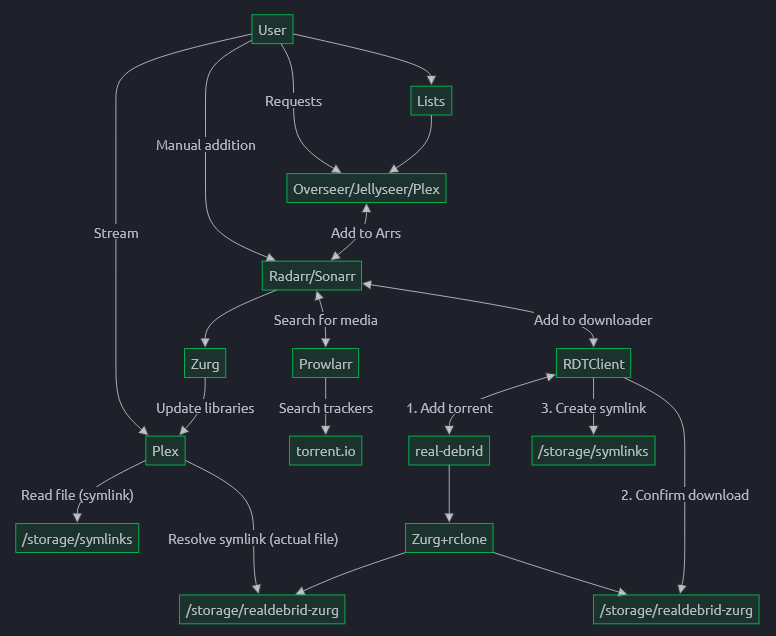

# MediaCenter
MediaCenter serves as a starting point for creating your own 'infinite' media library, powered by Real-Debrid and the *Arr stack. For educational/inspirational purposes only, there will be no support.

__Important: this is not a `docker compose up` and go type of ordeal. You'll need to do some manual configuration.__

__I'm still test driving this setup. Expect glitches.__

# Purpose
The purpose of this stack is to create a functioning stack of *Arr powered tools that allow for the streaming of cached torrents via Real-Debrid. All of this using Docker Containers.

I have never cared much for filling a NAS with media. I don't collect/curate media, I merely consume. This stack of tools is setup in a way that favors consumption. Perhaps it is possible to combine it with a setup of locally stored files, but I will leave that up to you to figure out.

The other purpose is purely personal: learning about the *Arrs and how I can make this entire stack work together. I'm not committed to this setup.

I'm just sharing my learnings, because there will undoubtedly be others who can use this as their starting point.

# Requirements
- Active [Real-Debrid](https://real-debrid.com/) subscription and your [API key](https://real-debrid.com/apitoken).
- Docker Engine. Tested on version 27.1.1 (preferably with your user added to the `docker` group).
- Docker Compose. Tested on version 2.29.1.

## My Setup
I'm running this stack in a Ubuntu Server (24.04 LTS) Virtual Machine (8GB RAM, 50GB disk (you don't need 50GB)) on a Proxmox node. Make sure the IP is static. You can probably(?) get this stack to work using LXC, but I haven't tried it.

I consume media exclusively via the Plex App on a Nvidia Shield Pro that Direct Plays almost all types of formats. My Radarr/Sonarr quality profiles are tweaked in such a way that I only grab content that my setup can Direct Play.

# Stack
- [Zurg](https://github.com/debridmediamanager/zurg-testing)
- [Rclone](https://github.com/rclone/rclone)
- [RDTClient](https://github.com/rogerfar/rdt-client)
- [Overseerr](https://overseerr.dev/)
- [Radarr](https://radarr.video/)
- [Sonarr](https://sonarr.tv/)
- [Recyclarr](https://recyclarr.dev/)
- [Prowlarr](https://prowlarr.com/)
- [Zilean](https://github.com/iPromKnight/zilean)
- [Plex](https://www.plex.tv/)
- [Autoscan](https://github.com/saltydk/autoscan)

Read the dedicated tool pages linked above to learn more about their function and configuration.

In a nutshell:
- Zurg + Rclone mount your Real-Debrid library into your filesystem.
- Request movies/series using Overseerr.
- Hand the request over to Radarr/Sonarr.
- Radarr/Sonarr instruct Prowlarr to search torrent indexers.
- Prowlarr returns found results to Radarr/Sonarr and pick a candidate.
- Radarr/Sonarr hands the torrent over to the RDTClient Download Client.
- RDTClient:
    - Adds the torrent to your Real-Debrid account.
    - Checks if the file is available on your filesystem (which is mounted by Rclone, remember).
    - Creates symlinks to Radarr/Sonarr's `completed` directory.
- Radarr/Sonarr continues processing as if the file exists locally and moves it to the media folder.
- Autoscan is triggered by Radarr/Sonarr and pushes a library refresh to Plex.
- Plex reads the file symlinks in the media folder. The symlinks resolve to the file in the Rclone mounted filesystem.

Visual representation (credits to ElfHosted):

# Setup - (WIP - Rough Outline)
__The most important thing is to get the permissions (775/664, umask 002) right. If files don't show up inside containers, it is most likely a permissions problem. If you decide to run everything as one user, use 755/644 umask 022 and tweak the necessary files as needed__

__The filesystem is designed to allow for [hardlinking](https://trash-guides.info/Hardlinks/Hardlinks-and-Instant-Moves/), as per the [Servarr Wiki recommendation](https://wiki.servarr.com/docker-guide#consistent-and-well-planned-paths).__

__If you are new to the *Arr stack, you must read the [Servarr Wiki](https://wiki.servarr.com/)!__

1. Add your Plex Claim Token to `.env` and tweak IDs to your liking.
    - Every container runs as its own user. All users are part of the same group. This is best practice.
2. Add your Real-Debrid API Token to `zurg.yml`.
3. Take a look at the `setup.sh` script and run it using `./setup.sh`.
    - `sudo chmod +x setup.sh` if it is not executable.
4. Reboot (virtual) machine.
5. Run `docker compose up -d`.
6. The first time you do this, `Zilean` is going to need some time to fill its database.
    - Follow progress with `docker compose logs zilean -f`
    - Continue when finished.
    - Why Zilean? Before Zilean I only used Torrentio, but practically zero series made it through the quality gates as prescribed by TRaSH-Guide. There appear to be some issues with the way Torrentio reports file sizes for season packs. You can of course use your preferred indexer instead and remove Zilean from the stack.
7. Setup RDTClient:
    - Settings -> General:
        - Maximum parallel downloads = `100`
        - Maximum unpack processes = `100`
        - Categories: `radarr,sonarr`
    - Settings -> Download Client:
        - Download Client = `Symlink Downloader`
        - Download path = `/data/symlinks`
        - Mapped path = `/data/symlinks`
        - Rclone mount path = `/data/realdebrid-zurg/__all__`
    - Settings -> Provider:
        - Provider = `RealDebrid`
        - API Key = `*Your API Key*`
    - Settings -> qBittorrent / *darr:
        - Post Torrent Download Action = `Download all files to host`
        - Post Download Action = `No Action`
        - Only download available files on debrid provider = `checked`
        - Minimum file size to download = `5`
        - Automatic retry downloadds = `5`
        - *(Unsure if these settings shoulds also be set on the Provider and GUI Defaults setting pages)*
8. Setup Radarr:
    - Consult the Servarr Wiki for guidance if needed.
    - Just follow the [TRaSH-Guides](https://trash-guides.info/Radarr/) for sensible defaults when setting up Quality Profiles, or see [Recyclarr Profile](#recyclarr-profile).
    - Set your Root Folder to `/data/media/movies`.
    - Take note of your API key under Settings -> General -> API Key.
9. Setup Sonarr:
    - Consult the Servarr Wiki for guidance if needed.
    - Just follow the [TRaSH-Guides](https://trash-guides.info/Sonarr/) for sensible defaults when setting up Quality Profiles, or see [Recyclarr Profile](#recyclarr-profile).
    - Set your Root Folder to `/data/media/tv`.
    - Take note of your API key under Settings -> General -> API Key.
10. Setup Overseerr.
11. Setup Prowlarr (no need to setup a Download Client).
    - Consult the Servarr Wiki for guidance if needed.
    - If you want to use Torrentio and/or Zilean:
        - Grab the files from [here](https://github.com/dreulavelle/Prowlarr-Indexers/tree/main/Custom) and place them inside `${ROOT_DIR}/config/prowlarr-config/Definitions/Custom/`.
    - Configure indexers.
12. Setup Autoscan.
    - Place the file `./autoscan/config.yml` in `${ROOT_DIR}/config/autoscan-config`.
    - Tweak the config if necessary.
    - Follow the instructions on the [GitHub repo](https://github.com/saltydk/autoscan?tab=readme-ov-file#the--arrs) to connect Radarr/Sonarr to Autoscan.
13. Setup Plex.
    - Configure movie library to point to `/data/media/movies`.
    - Configure tv library to point to `/data/media/tv`.

## Recyclarr Profile
Included in this repo is a `recyclarr.yml` file that will sync two quality profiles to Radarr and Sonarr. One for 1080p and one for 2160p. Out of the box these profiles will accept every type of quality for each resolution. E.g. the 1080p profile will accept everything from `HDTV-1080p` all the way up to `REMUX-1080p`, but prefers the highest quality.

Tweak the profiles to your needs or create your own from scratch. Consult the [Recyclarr website](https://recyclarr.dev/) for guidance.

Place the file `./recyclarr/recyclarr.yaml` in `${ROOT_DIR}/config/recyclarr-config/`. If docker compose is already running, run the following command: `docker compose exec recyclarr recyclarr sync` and monitor the output.

# Interesting Reads + Credits
- All the authors of the tools used in the stack. 
- [Servarr Wiki](https://wiki.servarr.com/). Especially the [Docker Guide](https://wiki.servarr.com/docker-guide).
- [ElfHosted's article](https://elfhosted.com/guides/media/stream-from-real-debrid-with-plex-radarr-sonarr-prowlarr/) that was my inspiration to try this myself.
- [Sailarr's Guide](https://savvyguides.wiki/sailarrsguide/).
- [Ezarr](https://github.com/Luctia/ezarr). Laid down the foundation using their approach. GOATs.
- [Debrid Media Manager](https://github.com/debridmediamanager/debrid-media-manager). Was my first look into the world of Debrid services.
- [dreulavelle/Prowlarr-Indexers](https://github.com/dreulavelle/Prowlarr-Indexers) for the Prowlarr torrentio and zilean configs.
